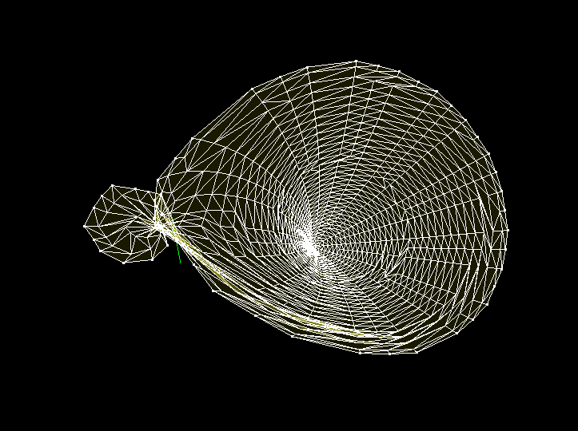
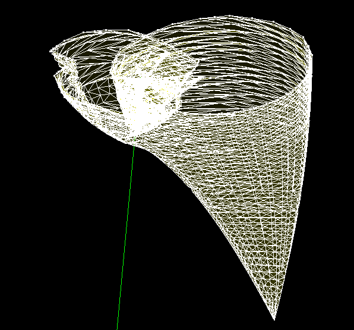
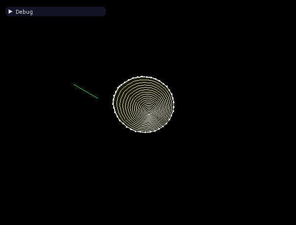
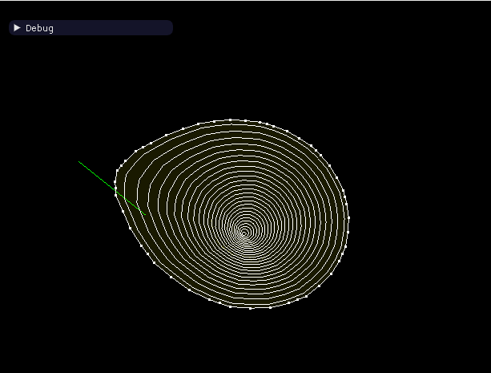

Wave propagation in arbitrary 2+1 metrics

Visualizes the light-cones in arbitrary equations-of-structure in 2+1 dimensions.

Right now it is set to use vacuum, Newton, or Schwarzschild metrics.  

Kerr-Schild metric is still broken.

